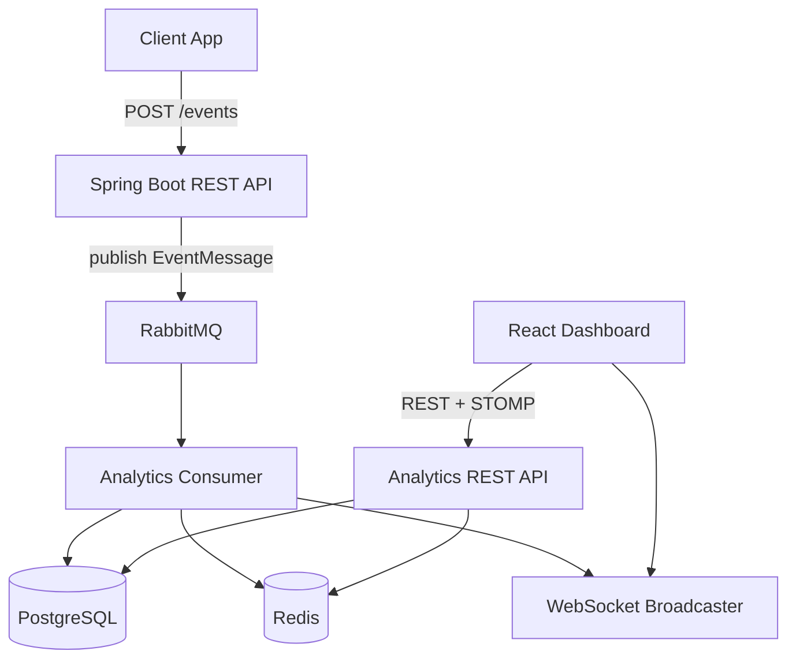

# PulseFlow

PulseFlow is an event-driven analytics platform: client apps send activity events via REST, events are processed asynchronously through RabbitMQ, persisted in PostgreSQL, cached in Redis, and streamed live to a React dashboard over WebSocket.

**One-line pitch:** Applications send us events, and we turn them into real-time analytics.

---

## Architecture



**Key design choices:**

- `POST /events` validates and publishes only — no synchronous DB/Redis writes on the ingest path.
- The consumer is the sole writer for event analytics data; processing is idempotent.
- Redis is a cache; Postgres is the source of truth.
- The dashboard polls REST as a fallback when WebSocket disconnects.

See also [`docs/api.md`](docs/api.md) for endpoint reference.

---

## Tech Stack

| Layer | Choice |
|-------|--------|
| Backend | Java 21, Spring Boot 3.x, Maven |
| Database | PostgreSQL 16 |
| Cache | Redis 7 |
| Message broker | RabbitMQ 3.x (management plugin) |
| Frontend | React (Vite), STOMP.js, Recharts |
| Auth | JWT (admin), API key (event ingestion) |
| API docs | springdoc-openapi (Swagger UI) |

---

## Quick Start (Docker — full stack)

```powershell
# From repo root — starts Postgres, Redis, RabbitMQ, backend, frontend
docker compose up -d --build
```

| Service | URL |
|---------|-----|
| Dashboard | http://localhost:3000 |
| Backend API | http://localhost:8082 |
| Swagger UI | http://localhost:8082/swagger-ui.html |
| RabbitMQ UI | http://localhost:15672 (guest/guest) |

Copy `.env.example` to `.env` and set `JWT_SECRET` and `EVENTS_API_KEY` before production use.

---

## Local Development

### 1) Infrastructure only

```powershell
docker compose up -d postgres redis rabbitmq
```

### 2) Backend

```powershell
cd backend
./mvnw spring-boot:run
```

### 3) Frontend

```powershell
cd frontend
npm install
npm run dev
```

Dashboard dev server: http://localhost:5173 (proxies API to backend).

### 4) Run tests

```powershell
cd backend
./mvnw test
```

Integration tests use Testcontainers (Docker required).

---

## Demo: send events

Register an admin, then fire sample events:

```powershell
# Register (once)
curl.exe -X POST http://localhost:8082/auth/register `
  -H "Content-Type: application/json" `
  -d "{\"username\":\"admin\",\"email\":\"admin@example.com\",\"password\":\"password123\"}"

# Send 50 events (requires Python + requests)
python scratch/send_events.py 50 0.5
```

Set `BACKEND_URL` and `API_KEY` in `scratch/send_events.py` if not using defaults.

---

## Environment Variables

See [`.env.example`](.env.example). Key variables:

| Variable | Purpose |
|----------|---------|
| `JWT_SECRET` | HS256 signing key (>=32 bytes) |
| `EVENTS_API_KEY` | Required `X-API-Key` header for `POST /events` |
| `EVENTS_RATE_LIMIT_MAX` | Max ingest requests per window (default 100) |
| `EVENTS_RATE_LIMIT_WINDOW_SECONDS` | Rate limit window in seconds (default 60) |

---

## Deployment Notes

- **Docker Compose** (included): `docker compose up -d --build` runs the full stack with health-checked dependencies.
- **Backend only**: build with `backend/Dockerfile`, point env vars at your Postgres/Redis/RabbitMQ instances.
- **Frontend only**: build with `frontend/Dockerfile`; nginx proxies API and WebSocket to the `backend` service name on the Compose network.
- Change default secrets (`JWT_SECRET`, `EVENTS_API_KEY`) before any non-local deployment.
- RabbitMQ management UI is exposed on port 15672 — restrict access in production.
