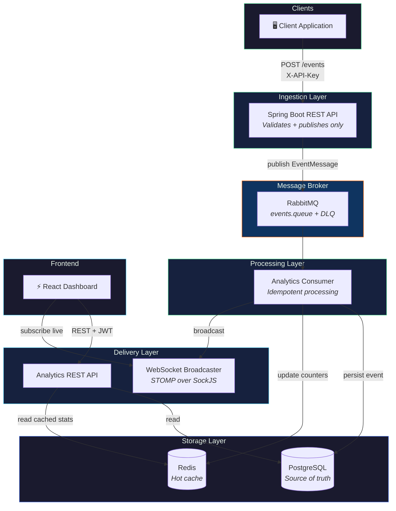

<div align="center">

# 🔄 PulseFlow

### Real-Time Event-Driven Analytics Platform

[](https://openjdk.org/)
[](https://spring.io/projects/spring-boot)
[](https://react.dev/)
[](https://www.postgresql.org/)
[](https://redis.io/)
[](https://www.rabbitmq.com/)
[](https://docs.docker.com/compose/)
[](LICENSE)

**Applications send us events. We turn them into real-time analytics.**

PulseFlow ingests activity events via REST, processes them asynchronously through RabbitMQ, persists data in PostgreSQL, caches hot statistics in Redis, and streams live updates to a React dashboard over WebSocket — all orchestrated with Docker Compose in a single command.

[Quick Start](#-quick-start) · [Architecture](#-architecture) · [API Reference](#-api-reference) · [Contributing](#-contributing)

</div>

---

## 📋 Table of Contents

- [Why PulseFlow?](#-why-pulseflow)
- [Key Features](#-key-features)
- [Architecture](#-architecture)
- [Tech Stack](#-tech-stack)
- [Quick Start](#-quick-start)
- [Local Development](#-local-development)
- [API Reference](#-api-reference)
- [Project Structure](#-project-structure)
- [Environment Variables](#-environment-variables)
- [Testing](#-testing)
- [Deployment](#-deployment)
- [Roadmap](#-roadmap)
- [Contributing](#-contributing)
- [License](#-license)

---

## 💡 Why PulseFlow?

Most backend portfolio projects are simple CRUD applications with a database. **PulseFlow goes further** — it demonstrates production-grade backend engineering patterns that power systems at scale:

| Concept | How PulseFlow Implements It |
|---|---|
| **Event-Driven Architecture** | Decoupled producers and consumers via RabbitMQ message broker |
| **Asynchronous Processing** | `POST /events` returns `202 Accepted` instantly — zero synchronous DB writes on the hot path |
| **Caching Strategy** | Redis as a fast, disposable accelerator; PostgreSQL as the source of truth |
| **Real-Time Delivery** | WebSocket (STOMP) pushes live updates; automatic REST polling fallback on disconnect |
| **Failure Resilience** | Dead-letter queues, exponential backoff retries, `failed_events` table — no event is silently lost |
| **Security** | JWT authentication for admins, API key-based auth for event ingestion, BCrypt password hashing |
| **Containerized Infrastructure** | Full-stack Docker Compose with health-checked dependencies |

---

## ✨ Key Features

### Backend
- ⚡ **High-throughput event ingestion** — sub-100ms response via async publish to RabbitMQ
- 🐇 **RabbitMQ consumer pipeline** — idempotent processing with configurable retry policy and dead-letter queue
- 🗄️ **PostgreSQL persistence** — durable event storage with JSONB metadata, pagination, and filtering
- 🚀 **Redis caching layer** — namespaced counters, sorted sets, and HyperLogLog for real-time analytics
- 🔐 **Dual authentication** — JWT (HS256) for admin dashboard, API key (`X-API-Key`) for machine clients
- 📊 **Analytics REST API** — summary, daily trends, top events, top users, and real-time snapshots
- 🔌 **WebSocket broadcasting** — STOMP-over-SockJS pushes processed events and stat updates live
- 📖 **OpenAPI documentation** — auto-generated Swagger UI at `/swagger-ui.html`
- 🛡️ **Rate limiting** — configurable per-key request throttling on the ingestion endpoint
- 🏥 **Health & monitoring** — queue depth, consumer status, Redis health, and audit logging

### Frontend
- 📈 **Live dashboard** — real-time counters with animated updates on every processed event
- 📉 **Interactive charts** — daily trend line chart and top events bar chart (Recharts)
- 📋 **Event log** — paginated, filterable event browser with detail view
- 🔄 **Graceful degradation** — auto-fallback from WebSocket to REST polling with reconnect indicator
- 🎨 **Instrument-panel aesthetic** — dark theme, JetBrains Mono typography, glassmorphism UI

---

## 🏗 Architecture



### Key Design Decisions

| Decision | Rationale |
|---|---|
| **Ingestion is publish-only** | `POST /events` never touches Postgres or Redis synchronously — guarantees sub-100ms latency regardless of downstream load |
| **Single writer principle** | The RabbitMQ consumer is the sole writer for event data — centralizes retry/failure logic and eliminates race conditions |
| **Redis is disposable** | Every Redis key is reconstructible from Postgres — cache failures never cause data loss |
| **WebSocket + polling fallback** | Dashboard never goes blank — automatically switches to 5s REST polling if WebSocket disconnects |
| **Dead-letter queue** | Failed messages are retried with exponential backoff, then routed to DLQ + `failed_events` table — zero silent data loss |

---

## 🛠 Tech Stack

| Layer | Technology | Purpose |
|---|---|---|
| **Language** | Java 21 LTS | Modern LTS with virtual threads support |
| **Framework** | Spring Boot 3.5 | Web, Security, Data JPA, AMQP, WebSocket, Validation |
| **Database** | PostgreSQL 16 | Durable event storage with JSONB, indexing, and full-text search |
| **Cache** | Redis 7 | Counters, sorted sets, HyperLogLog for real-time analytics |
| **Message Broker** | RabbitMQ 3.x | Topic exchange, dead-letter queue, management plugin |
| **Frontend** | React 19 + Vite 8 | SPA dashboard with STOMP.js WebSocket client |
| **Charting** | Recharts 3.9 | Interactive line and bar charts |
| **Auth** | Spring Security + JWT | HS256 token-based authentication |
| **API Docs** | springdoc-openapi 2.8 | Auto-generated Swagger UI |
| **Testing** | JUnit 5 + Testcontainers | Integration tests with real Postgres, Redis, and RabbitMQ |
| **Infrastructure** | Docker Compose | Full-stack orchestration with health checks |
| **Reverse Proxy** | Nginx | Frontend static serving + API/WebSocket proxying |

---

## 🚀 Quick Start

### Prerequisites

- [Docker](https://docs.docker.com/get-docker/) & [Docker Compose](https://docs.docker.com/compose/install/) installed
- Ports `3000`, `5432`, `5672`, `6379`, `8082`, `15672` available

### One-Command Launch

```bash
# Clone the repository
git clone https://github.com/Abdul-Rafy2005/pulseflow.git
cd pulseflow

# Copy environment config
cp .env.example .env

# Start the full stack (Postgres, Redis, RabbitMQ, Backend, Frontend)
docker compose up -d --build
```

### Access the Stack

| Service | URL | Credentials |
|---|---|---|
| 📊 **Dashboard** | [http://localhost:3000](http://localhost:3000) | Register via UI |
| 🔌 **Backend API** | [http://localhost:8082](http://localhost:8082) | JWT / API Key |
| 📖 **Swagger UI** | [http://localhost:8082/swagger-ui.html](http://localhost:8082/swagger-ui.html) | — |
| 🐇 **RabbitMQ UI** | [http://localhost:15672](http://localhost:15672) | `guest` / `guest` |

### Send Test Events

```bash
# 1. Register an admin account
curl -X POST http://localhost:8082/auth/register \
  -H "Content-Type: application/json" \
  -d '{"username":"admin","email":"admin@example.com","password":"password123"}'

# 2. Fire 50 sample events (requires Python + requests)
python scratch/send_events.py 50 0.5
```

> **Tip:** Set `BACKEND_URL` and `API_KEY` in `scratch/send_events.py` if not using default values.

---

## 🔧 Local Development

### 1. Start Infrastructure Only

```bash
docker compose up -d postgres redis rabbitmq
```

### 2. Run the Backend

```bash
cd backend
./mvnw spring-boot:run
```

The backend starts on port `8080` (or as configured in `SERVER_PORT`).

### 3. Run the Frontend

```bash
cd frontend
npm install
npm run dev
```

Dashboard dev server runs at [http://localhost:5173](http://localhost:5173) with API proxy to backend.

---

## 📡 API Reference

Full interactive documentation is available at [`/swagger-ui.html`](http://localhost:8082/swagger-ui.html) when the backend is running. See also [`docs/api.md`](docs/api.md) for the full endpoint reference.

### Authentication

| Method | Endpoint | Auth | Description |
|---|---|---|---|
| `POST` | `/auth/register` | None | Create an admin account |
| `POST` | `/auth/login` | None | Authenticate and receive JWT |
| `GET` | `/auth/profile` | JWT | Get current user profile |

### Event Ingestion

| Method | Endpoint | Auth | Description |
|---|---|---|---|
| `POST` | `/events` | API Key | Ingest event → returns `202 Accepted` immediately |
| `GET` | `/events` | JWT | Paginated & filterable event list |
| `GET` | `/events/{id}` | JWT | Single event detail |

**Example — Ingest an event:**
```bash
curl -X POST http://localhost:8082/events \
  -H "Content-Type: application/json" \
  -H "X-API-Key: your-api-key" \
  -d '{
    "eventType": "PAGE_VIEW",
    "userId": 42,
    "source": "my-app",
    "metadata": {"page": "/dashboard", "device": "Desktop", "country": "PK"}
  }'
```

**Supported Event Types:**
`LOGIN` · `LOGOUT` · `REGISTER` · `SEARCH` · `PAGE_VIEW` · `BUTTON_CLICK` · `PURCHASE` · `VIDEO_PLAY` · `LIKE` · `COMMENT` · `SHARE` · `DOWNLOAD`

### Analytics

| Method | Endpoint | Auth | Description |
|---|---|---|---|
| `GET` | `/analytics/summary` | JWT | Today's aggregated totals (Redis-first) |
| `GET` | `/analytics/daily` | JWT | Time-series data for the last N days |
| `GET` | `/analytics/top-events` | JWT | Ranked event types by frequency |
| `GET` | `/analytics/top-users` | JWT | Most active users ranked |
| `GET` | `/analytics/realtime` | JWT | Live snapshot for dashboard initialization |

### System Monitoring

| Method | Endpoint | Auth | Description |
|---|---|---|---|
| `GET` | `/health` | None | Liveness / readiness probe |
| `GET` | `/queue/status` | JWT | Queue depth, consumer count, DLQ size |
| `GET` | `/redis/status` | JWT | Connection health, key count, memory usage |

### WebSocket

| Endpoint | Protocol | Topics |
|---|---|---|
| `/ws` | STOMP over SockJS | `/topic/events` (live event stream) · `/topic/stats` (live counters) |

---

## 📁 Project Structure

```
pulseflow/
├── backend/                          # Spring Boot application
│   ├── src/main/java/com/pulseflow/backend/
│   │   ├── auth/                     # JWT auth, registration, login, role guards
│   │   ├── events/                   # Event ingestion, validation, RabbitMQ publishing
│   │   ├── queue/                    # RabbitMQ exchange, queue, bindings, DLQ config
│   │   ├── analytics/                # Consumer logic, aggregation, Redis R/W, REST APIs
│   │   ├── dashboard/                # WebSocket config + broadcast service
│   │   ├── monitoring/               # Health checks, queue/Redis status, audit logs
│   │   ├── config/                   # Security, CORS, Swagger, exception handling
│   │   └── common/                   # Shared DTOs, utilities, constants
│   ├── src/test/                     # Unit + integration tests (Testcontainers)
│   ├── Dockerfile                    # Multi-stage build
│   └── pom.xml                       # Maven dependencies
│
├── frontend/                         # React SPA (Vite)
│   ├── src/
│   │   ├── components/
│   │   │   ├── LoginPage.jsx         # Authentication UI
│   │   │   ├── HeroStrip.jsx         # Real-time stat counters
│   │   │   ├── DailyTrendChart.jsx   # Line chart — events over time
│   │   │   ├── TopEventsChart.jsx    # Bar chart — event type distribution
│   │   │   ├── RecentEvents.jsx      # Live event stream feed
│   │   │   ├── EventsLog.jsx         # Paginated event browser
│   │   │   └── ConnectionStatus.jsx  # WebSocket status indicator
│   │   ├── services/
│   │   │   ├── api.js                # REST client (auth, analytics, events)
│   │   │   └── websocket.js          # STOMP WebSocket client + reconnection
│   │   ├── App.jsx                   # Main application with routing
│   │   └── index.css                 # Design system (dark theme, animations)
│   ├── nginx.conf                    # Reverse proxy for API + WebSocket
│   └── Dockerfile                    # Production build + Nginx
│
├── docs/
│   ├── PRD.md                        # Product Requirements Document
│   ├── api.md                        # Full API specification
│   └── AGENT.md                      # Development guidelines
│
├── scratch/
│   └── send_events.py                # Load testing / demo event generator
│
├── docker-compose.yml                # Full-stack orchestration
├── .env.example                      # Environment variable template
└── .gitignore
```

---

## ⚙️ Environment Variables

Copy `.env.example` to `.env` before running. **Never commit `.env` to version control.**

| Variable | Required | Default | Description |
|---|---|---|---|
| `JWT_SECRET` | ✅ | — | HS256 signing key (≥32 bytes) |
| `EVENTS_API_KEY` | ✅ | — | Required `X-API-Key` header for event ingestion |
| `SPRING_DATASOURCE_URL` | ✅ | `jdbc:postgresql://localhost:5432/pulseflow` | PostgreSQL connection string |
| `SPRING_DATASOURCE_USERNAME` | ✅ | `pulseflow` | Database user |
| `SPRING_DATASOURCE_PASSWORD` | ✅ | `pulseflow` | Database password |
| `SPRING_RABBITMQ_HOST` | ✅ | `localhost` | RabbitMQ hostname |
| `SPRING_DATA_REDIS_HOST` | ✅ | `localhost` | Redis hostname |
| `EVENTS_RATE_LIMIT_MAX` | ❌ | `100` | Max ingestion requests per window |
| `EVENTS_RATE_LIMIT_WINDOW_SECONDS` | ❌ | `60` | Rate limit window duration |
| `JWT_EXPIRATION` | ❌ | `PT24H` | Token expiration (ISO 8601 duration) |
| `SERVER_PORT` | ❌ | `8080` | Backend server port |

---

## 🧪 Testing

```bash
cd backend
./mvnw test
```

- **Unit tests** — service layer logic, validation, DTOs
- **Integration tests** — full ingest → queue → consume → persist pipeline using [Testcontainers](https://testcontainers.com/) (Docker required)

---

## 🚢 Deployment

### Docker Compose (Included)

```bash
docker compose up -d --build
```

Brings up the entire stack with health-checked dependencies. Change `JWT_SECRET` and `EVENTS_API_KEY` before any non-local deployment.

### Backend Standalone

Build with `backend/Dockerfile` and point environment variables at your managed Postgres, Redis, and RabbitMQ instances.

### Frontend Standalone

Build with `frontend/Dockerfile` — serves static assets via Nginx and proxies `/api` and `/ws` to the backend service.

### Production Checklist

- [ ] Set strong, unique values for `JWT_SECRET` and `EVENTS_API_KEY`
- [ ] Restrict RabbitMQ management UI (port `15672`) access
- [ ] Enable TLS/HTTPS termination
- [ ] Configure log aggregation for structured JSON logs
- [ ] Set up database backups for PostgreSQL

---

## 🗺 Roadmap

- [ ] Multi-tenant support — isolated analytics per client organization
- [ ] Anomaly detection consumer — flag unusual event patterns
- [ ] Alerting system — Slack/email notifications on queue backlog or anomalies
- [ ] Event replay endpoint — manually replay events from the dead-letter queue
- [ ] Grafana integration — metrics dashboards and alerting
- [ ] Horizontal scaling — Kubernetes manifests for production deployments

---

## 🤝 Contributing

Contributions are welcome! Please follow these steps:

1. **Fork** the repository
2. **Create** a feature branch (`git checkout -b feature/amazing-feature`)
3. **Commit** your changes (`git commit -m 'feat: add amazing feature'`)
4. **Push** to the branch (`git push origin feature/amazing-feature`)
5. **Open** a Pull Request

---

## 📄 License

This project is open source and available under the [MIT License](LICENSE).

---

<div align="center">

**Built by [Abdul Rafy](https://github.com/Abdul-Rafy2005)**

If this project helped you or you found it interesting, please consider giving it a ⭐

</div>
